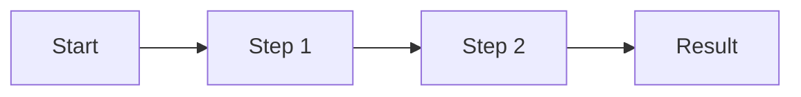

# Excalidraw Flow Export

Create and deliver an Excalidraw diagram with a repeatable browser workflow.

## Recon-first rule for web tasks

Before final execution, fan out 2-3 short reconnaissance passes (sub-sessions) when possible:

1. Map page structure and key controls.
2. Confirm native capabilities (import, export formats, dialogs).
3. Identify failure modes and recovery steps.

Then run one deterministic main pass for delivery.

## Use this workflow

1. Open `https://excalidraw.com` in browser automation.
2. Open `更多工具` -> `Mermaid 至 Excalidraw`.
3. Paste Mermaid flowchart text.
4. Insert diagram.
5. Open menu -> `导出图片...`.
6. Use native export button (`导出为 PNG` or `导出为 SVG`).
7. Deliver exported file to user via channel attachment.

## Mermaid template (flowchart)

## Quality checklist

- Keep node text short (1-2 lines per node).
- Prefer `LR` for presentation slides; use `TD` for reading docs.
- Ensure one clear main path; put caveats on side branches.
- If output looks cramped, simplify node labels and re-insert.

## Export conventions

- Default output: Excalidraw native export (`PNG` preferred, `SVG` when requested).
- Do not use browser screenshots as final deliverables.
- Filename pattern: `excalidraw-<topic>-<YYYYMMDD-HHMM>.png`.
- Keep one source Mermaid snippet in the response so the user can regenerate quickly.

## Recovery

- If Excalidraw dialog does not appear, re-open `更多工具` and click `Mermaid 至 Excalidraw` again.
- If `导出为 PNG` is disabled, uncheck `仅选中` in the export dialog.
- If browser controller is unavailable, provide Mermaid code and manual import steps immediately.
