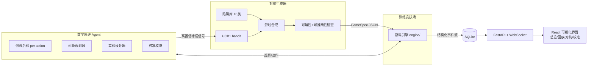

# ARC3-Math：以"空间变换函数"为核心认知的 ARC-AGI-3 Agent 训练系统

> 总方案。分模块细节见 `specs/01` ~ `specs/07`，执行顺序与验收标准见 `specs/07-milestones.md`。

## 1. 一句话

让 agent 把游戏里的每个动作理解为一个**空间变换函数**（如 上 = T(0,-1)），用函数假设的贝叶斯推断来"思考"，用函数合成的心理模拟来"想象/推演"；同时用一个**对抗式游戏合成器**专门生产"打破习以为常函数"的陷阱游戏，逼迫 agent 学会**可信度判断**（什么时候该相信自己的假设，什么时候该先做实验验证）。

## 2. 核心理念（数学骨架）

### 2.1 动作即变换

游戏状态 s = (网格, 实体们)。每个动作 a 诱导一个变换 f_a : S → S。
f_a 来自一个结构化的函数空间（DSL，见 `specs/01-dsl.md`）：

- 基础原语：平移 T(dx,dy)、旋转 R_k（k×90°）、镜像 M_axis、恒等 I、染色 C(π)
- 组合子：合成 Compose、共轭 Conjugate(g, f) = g∘f∘g⁻¹、条件分支 Conditional(谓词, f, g)

**共轭定律**是本方案的灵魂：对线性变换 g，有

```
g ∘ T(v) ∘ g⁻¹ = T(g·v)
```

即：换了参考系（旋转/镜像了的世界）之后，"上"这个函数本身没变，只是它的平移向量被 g 作用了。所以：

- "镜像房间里按上其实往下" = M_y ∘ T(0,-1) ∘ M_y⁻¹ = T(0,+1)
- "斜着向上的按钮" = 合成 T(1,0)∘T(0,-1) = T(1,-1)，或某个 g 共轭后的普通"上"
- agent 看到反常行为时，第一反应不该是"随机乱试"，而是"这可能是我熟悉的函数被共轭/合成/条件化了"

### 2.2 思考 = 假设推断

Agent 对每个动作 a 维护一个假设后验 P(f_a | 历史观察)：

- 先验 ∝ exp(−MDL)：程序越短越可信（平移比共轭旋转先验高）——这正是"习以为常"的数学化
- 每次观察 (s, a, s')：与预测一致的假设权重上升，不一致的被淘汰
- 全部假设被淘汰 → 触发"信念修正"事件：带着观察约束重新枚举更复杂的程序（陷阱被识破的时刻）

### 2.3 想象/推演 = 函数合成的心理模拟

规划时 agent 不真的走，而是拿当前 MAP 假设 f_a 在脑内合成序列 f_{a_k}∘…∘f_{a_1}(s)，搜索能到达目标的动作串。UI 里把这个"想象轨迹"渲染成半透明幽灵帧，与真实结果叠加对比。

### 2.4 可信度 = 校准过的后验

- 每一步 agent 必须输出预测置信度 p = P(预测的下一状态正确)
- 事后用真实结果打分（Brier / ECE 可靠性图）
- 规划风险控制：路径上最小置信度 < τ 时，先插入低成本"实验动作"消歧，再执行目标计划——**这就是"懂得可信度的判断"的行为化定义**

### 2.5 对抗合成 = 专攻先验的陷阱

生成器不追求"难"，追求"**高置信错误**"：agent 很自信但错了的游戏得分最高。陷阱库（10 类，见 `specs/04-generator.md`）全部围绕"把习以为常的函数偷偷替换成它的共轭/合成/条件化版本"。用 UCB1 bandit 学习哪些陷阱组合最能骗到当前 agent，形成自动课程。

**硬约束**：合成的游戏必须（a）可解——预言机 BFS 可达终点；（b）可推断——存在 ≤K 步的实验序列能唯一确定通关所需的 f_a。不可解/不可推断的游戏是噪声，直接丢弃。

## 3. 系统架构



## 4. 技术栈（低级模型不得擅自更换）

| 层 | 选型 |
|---|---|
| 后端 | Python 3.11+，FastAPI，uvicorn，numpy，sqlite3（标准库），pytest |
| 前端 | Vite + React + TypeScript，recharts（图表），Canvas 2D（网格渲染），原生 CSS |
| 通信 | REST + WebSocket，全部 JSON，schema 固定（见 `specs/05`） |
| Agent v1 | 纯符号贝叶斯程序归纳（无 GPU、确定性、可测试） |
| Agent v2（可选扩展） | LLM 提出 DSL 假设 + 后端验证；SFT 数据导出（见 `specs/03` §7） |

## 5. 仓库目录结构（M0 建立）

```
arc3-math/
├── backend/
│   ├── arc3math/
│   │   ├── dsl/          # 变换程序：AST、解释器、枚举、MDL
│   │   ├── engine/       # 游戏引擎：GameSpec、step()、胜负判定
│   │   ├── agent/        # 假设管理、规划器、实验设计、校准
│   │   ├── generator/    # 模板、陷阱库、检查器、bandit
│   │   ├── arena/        # 训练循环编排、事件日志
│   │   └── api/          # FastAPI 应用、WS 广播
│   ├── games/            # 手写示例游戏 JSON
│   ├── tests/
│   └── pyproject.toml
├── frontend/             # Vite + React + TS
├── specs/                # 本方案的分模块规格（已写好，勿改）
├── Makefile              # make test / make dev / make arena
└── PLAN.md
```

## 6. 里程碑总览（细节与验收标准见 specs/07）

| 里程碑 | 内容 | 你能看到什么 |
|---|---|---|
| M0 | 脚手架 + DSL + 解释器 + 单测 | `make test` 全绿 |
| M1 | 引擎 + 5 个手写游戏 + 贝叶斯 agent + CLI 回放 | 终端里看 agent 解题轨迹 JSON |
| M2 | FastAPI + 事件流 + **对局回放 UI**（核心视图） | 浏览器里逐帧看：棋盘 + agent 脑内假设 + 想象 vs 现实 |
| M3 | 对抗生成器 + 竞技场循环 + 对抗/校准视图 | 看陷阱骗过 agent → agent 修正信念的全过程 |
| M4 | 总览仪表盘 + bandit 课程 + SFT 数据导出 | 训练曲线、校准曲线、陷阱热力图 |
| M5（可选） | 真实 ARC-AGI-3 API 适配器 | 同一个 agent 打官方游戏 |

## 7. 交付与执行方式（给你操作用）

1. 每个里程碑开一个新会话交给低级模型，喂入：`PLAN.md` + 对应的 specs 文件 + `specs/07-milestones.md` 中该里程碑的验收标准。
2. 要求它严格按 schema 实现，跑完验收命令并贴出输出，才算完成。
3. 里程碑之间由你（或一个审查会话）验收：跑 `make test` + 验收命令 + 肉眼看 UI。
4. **执行守则**（每次都附上）：见 `specs/07-milestones.md` §0。

## 8. 成功指标

- 解题率、中位步数（越低越好）
- **探针效率**：确定通关所需全部 f_a 所花的实验步数
- **ECE**（期望校准误差）持续下降
- **高置信错误率**（confidence>0.8 且预测错）→ 趋近 0
- 生成器视角：能骗到 agent 的陷阱组合越来越少（热力图变绿）
